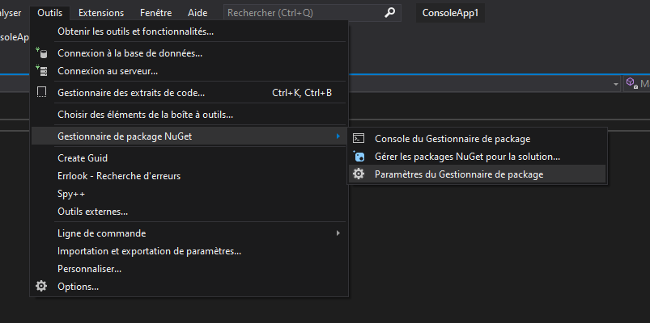

# Nuget et Visual Studio

**Premierement, qu'est ce que nuget ?**  
Nuget est le gestionnaire de paquets de la plate forme de développement Microsoft .NET (comme node pour JS).

## Configurer Nuget sur Visual Studio

- Aller dans 'Outis **/** Gestionnaire de package NuGet **/** Paramètres du Gestionnaire de package' 

- Appuyer sur la croix verte, puis changez la source par l'url suivante :
https://api.nuget.org/v3/index.json

